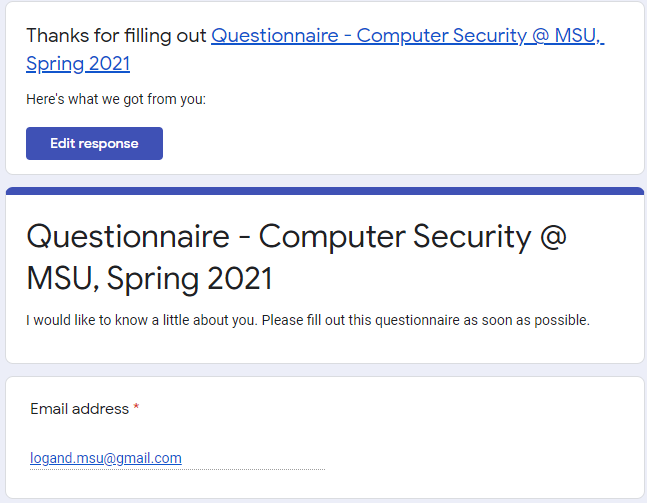
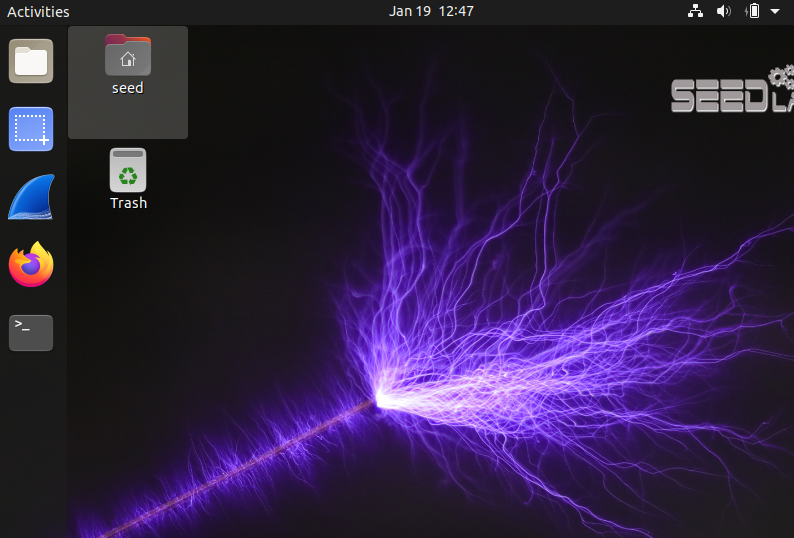

# lab00
Private repo for MSU CSCI 476 Computer Security
* Logan Dolechek
* n47f693
* CSCI 476  
* <logand.msu@gmail.com>
 
 

## Three lessons learned
* First lesson I have learned is that I need to do a better job organizing files and other items for projects better on my local machines. Between my laptop/desktop I have too many workspaces and things seem cluttered. 
* Second lesson I learned was how to set up the VM & SEED. 
* Third lesson I learned is that I really need to spend more time on the command line and with using Git. I don't feel comfortable nor fast as I would like to be. 
