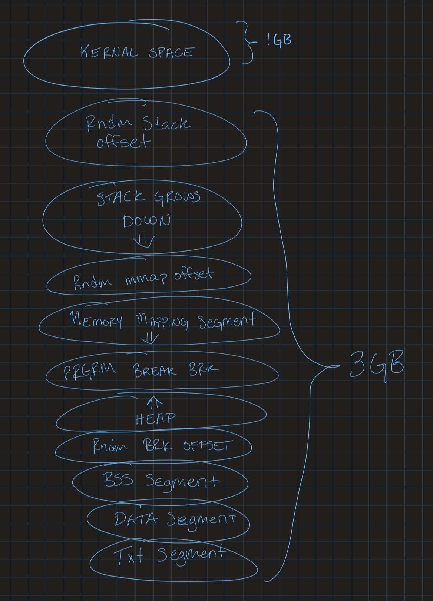

# Systems & Software
## Logan Dolechek (n47f693)
## logand.msu@gmail.com
## CSCI 476
## 1/29/2021
---

1. When fork() is called it takes the current process and duplicates that. The new process is the child to the Parent process that was occuring earlier. Exec() instead replaces/substitutes the current process with a new one. 
2. 
3. I think it is important to keep code and data seperate because if code and data lived in the same place and someone was to load data that resembles code, this could be extremely detrimental to the overall system or program.
4. So my main concerns would be overlap between the stack and memory mapping segment, or overlap between the heap and memory mapping segment, as any of these regions expand/grow. How do we handle that, what do we do, etc. 
5. A trust boundary is where the execution or program data changes it's trust. For example, if a regular user were to run a program for manipulating network interfaces, the program may need to escalate privilege in order to initiate certain interfaces.
6. Some major elements of the stack frame that we discussed in class would be. Return address, Previous frame pointer, Local Variables, Saved copies of registers modified by subprograms that could need restoration, Argument parameters.
